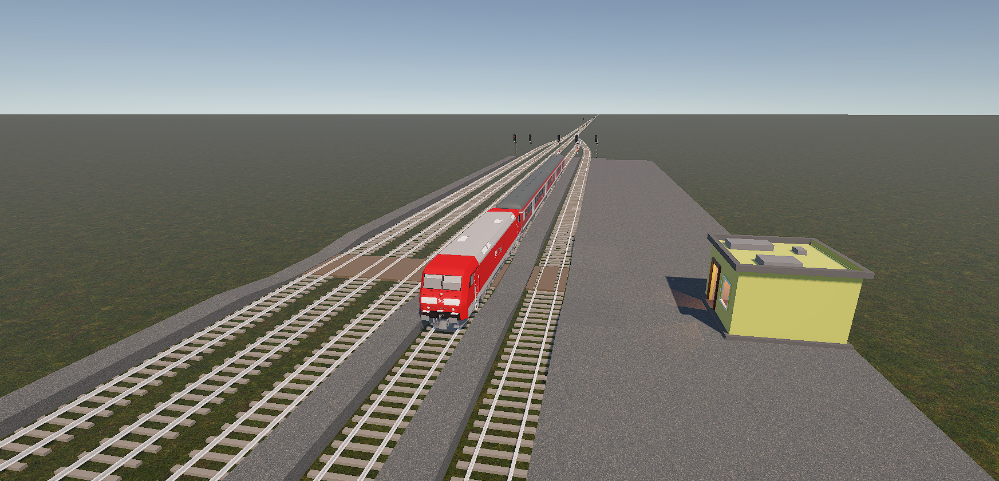
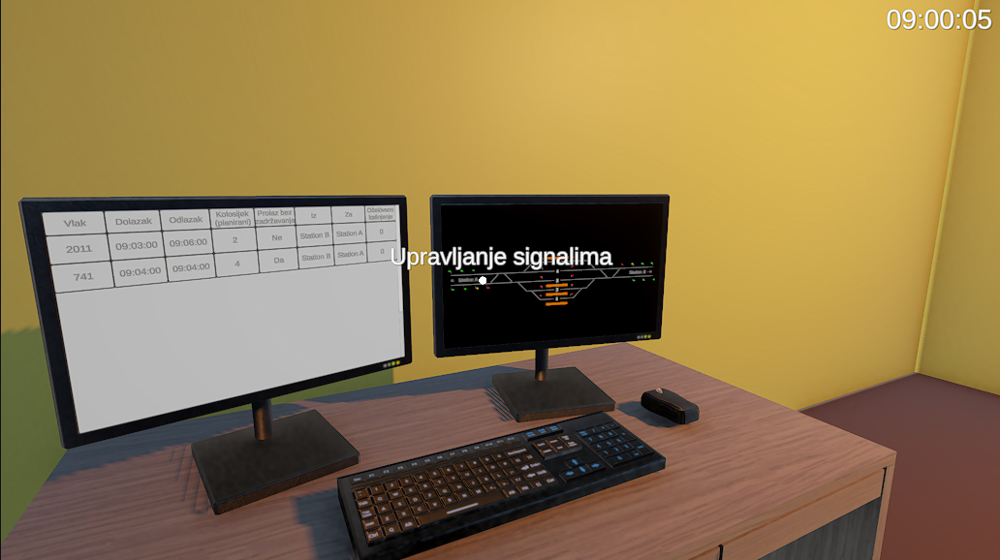

## Interactive simulation of a railway station dispatcher's work

Interactive simulation developed in the Unity engine in which the user assumes the role of a railway station dispatcher. The user coordinates the arrival and departure of trains by setting their routes through the station and adjusting the necessary signals in a 2D control interface. These decisions and train movements are then reflected in the 3D world of the simulation.
The simulation was developed as part of a bachelor's thesis.

Birdseye view of the station

Control interface (right monitor) and timetable (left monitor)

Video showcase:

https://github.com/user-attachments/assets/108ace5f-80de-48f9-9fce-5fa48e1802b9
